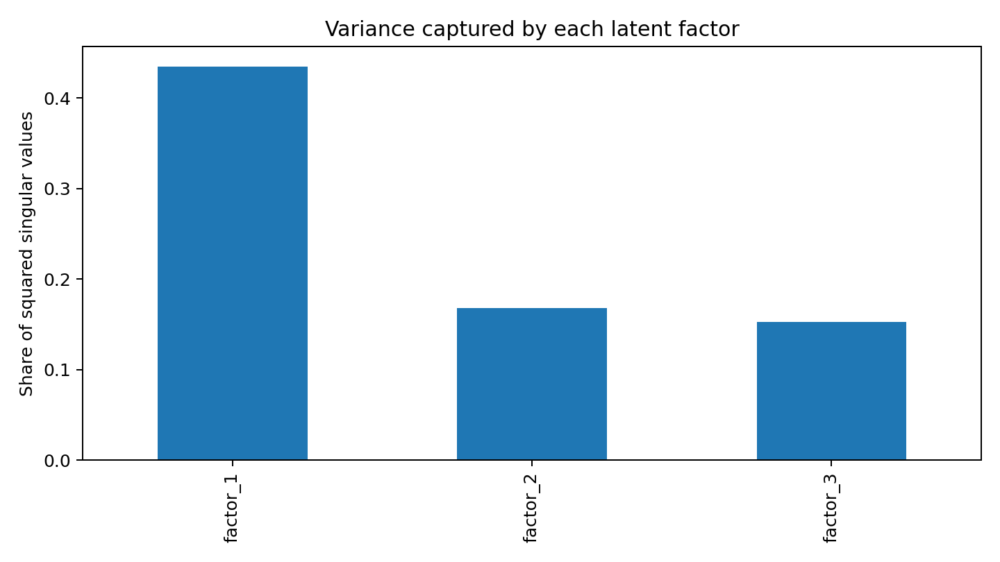

# Latent-Factor Brand Perception Model

An end-to-end natural-language processing project that turns brand descriptions into an interpretable map of brand associations. It extracts attributes, constructs a brand-by-attribute matrix, applies positive pointwise mutual information (PPMI), and uses singular value decomposition (SVD) to uncover latent positioning factors.



## Why this project matters

Brand surveys are expensive and slow. This project tests whether language-model-generated descriptions can support an exploratory brand-perception map. It is a research prototype—not a replacement for consumer research—and explicitly separates generated evidence from validated human opinion.

## Reproducible example

The repository includes a cleaned six-brand, 39-attribute example matrix:

```bash
python -m venv .venv
source .venv/bin/activate
pip install -r requirements.txt
python run_pipeline.py
```

Results are written to `results/`. No application programming interface key or local language model is required for this example.

## Method

1. Generate prompts across brands, comparison factors, personas, and time frames.
2. Produce descriptions with a local language model.
3. Extract brand-linked nouns and adjectives with spaCy.
4. Filter and merge noisy attributes.
5. Convert counts to PPMI, reducing the weight of common attributes.
6. Factorize the matrix as $M \approx U\Sigma V^T$.
7. Interpret factors using the brands and attributes with the largest loadings.

## Repository structure

```text
data/sample/                 Clean example input
docs/images/                 README figures
notebooks/                   Exploratory workflow
src/data_collection/         Optional text generation
src/data_analysis/           Extraction, PPMI, SVD, and scoring
tests/                       Numerical and validation tests
run_pipeline.py              One-command deterministic analysis
```

## Validation

```bash
pip install -r requirements-dev.txt
pytest -q
ruff check run_pipeline.py src tests
```

Tests cover input validation, finite non-negative PPMI values, and exact full-rank SVD reconstruction.

## Research limitations

- Generated descriptions reflect model and prompt choices, not a representative consumer sample.
- Language-model filtering and grouping introduce model-dependent judgment.
- Six brands are enough for a demonstration, not stable market estimates.
- Factor signs and order are arbitrary; interpretation requires inspecting both sets of loadings.
- A production study needs human labels, repeated runs, baselines, and stability metrics.

## Recommended next evaluation

Label a stratified sample of brand-attribute pairs with human raters. Report extraction precision and recall, grouping agreement, rank correlation with survey results, and stability under prompt and model changes. Compare PPMI plus SVD against raw frequency and term frequency–inverse document frequency baselines.

## Technology

Python, pandas, NumPy, spaCy, matplotlib, Ollama, OpenAI API, PPMI, and SVD.

## License

MIT
